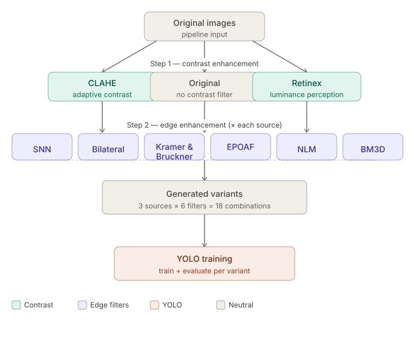

# 🐝 Bee Recognition & Behaviour Analysis

A research pipeline for **marker-free honeybee detection, pose estimation, and collective behaviour analysis** from IR hive camera footage.  
The system fine-tunes **YOLOv8n-pose** to simultaneously detect bees, classify them (cleaning / normal), and regress three anatomical keypoints (head, tail, wing root) per individual — all in a single forward pass.


---

## Table of Contents

- [Overview](#overview)
- [Results](#results)
- [Project Structure](#project-structure)
- [Installation](#installation)
- [Usage](#usage)
  - [1 — Prepare the dataset](#1--prepare-the-dataset)
  - [2 — Train all pipelines](#2--train-all-pipelines)
  - [3 — Generate analysis plots](#3--generate-analysis-plots)
  - [4 — Run the web app](#4--run-the-web-app)
- [Preprocessing Pipelines](#preprocessing-pipelines)
- [Behavioural Analyses](#behavioural-analyses)
- [Web Application](#web-application)

---

## Overview

Raw IR hive footage is characterised by low contrast, uneven illumination, and sensor noise. To find the best preprocessing strategy, we systematically evaluate **15 pipelines** — all pairwise combinations of 3 contrast methods and 5 edge-preserving filters — each trained independently under identical YOLOv8n-pose conditions.

The pipeline overview:

```
Original images
      │
      ├── Original ──┐
      ├── CLAHE    ──┼──> Bilateral / NLM / SNN / Kramer-Brückner / EPOAF
      └── Retinex  ──┘
                         15 variants → YOLOv8n-pose train & test
```

For **live hive monitoring at 30 fps**, preprocessing must fit within ~18 ms. Only EPOAF-based pipelines satisfy this constraint; the live-to-offline accuracy gap is just **2.5 pp**.



---

## Results

| Pipeline | Box mAP50 | Pose mAP50 | Preproc. (ms) | Live |
|---|---|---|---|---|
| **Retinex + SNN** | **79.5 %** | **77.8 %** | 283 | |
| Retinex + NLM | 79.1 % | 77.4 % | 274 | |
| Retinex + EPOAF | 79.1 % | 78.0 % | 124 | |
| Original + Kramer-Brückner | 79.0 % | 77.3 % | 179 | |
| Retinex + Kramer-Brückner | 78.5 % | 76.5 % | 296 | |
| CLAHE + SNN | 78.4 % | 76.9 % | 176 | |
| **CLAHE + EPOAF** ✅ | **77.0 %** | **75.5 %** | **17** | **live** |
| Original + EPOAF ✅ | 76.6 % | 74.6 % | 7 | live |
| … | … | … | … | |

> **Recommended offline pipeline:** Retinex + SNN (79.5 % Box mAP50)  
> **Recommended live pipeline:** CLAHE + EPOAF (77.0 % Box mAP50, 17 ms)

Dataset: **800 images** · 560 train / 120 val / 120 test · **7 658 annotations** (187 cleaning / 7 471 normal)

---

## Project Structure

```
├── App/
│   ├── app.py                  # Flask web application
│   ├── bee_analysis.py         # Behavioural analysis functions
│   ├── bee_pose.yaml           # YOLO dataset config
│   ├── config.py               # Paths and constants
│   ├── filter_params.json      # Per-filter hyperparameters
│   ├── pipeline_transforms.py  # All 15 preprocessing pipelines
│   ├── yolo_pipeline_train.py  # Pipeline benchmark training loop
│   ├── yolov8n-pose.pt         # Base YOLOv8n-pose weights
│   ├── outputs/                # Training runs, results JSON, plots
│   └── templates/              # HTML templates for the web app
│
├── filtres/                    # Filter development & experiments
├── filtres.ipynb               # Jupyter notebook — filter exploration
├── grille_filtres.py           # Generates the 3×5 pipeline grid image
├── generate_figures.py         # Paper figure generation
├── crop_640.py                 # Crop frames to 640 px
├── crop_region.py              # Region-based frame cropping
├── figures/                    # Generated figures for the paper
└── images2_424px/              # Sample frames at 424 px
```

---

## Installation

```bash
pip install ultralytics opencv-python flask numpy scipy matplotlib pandas
```

> Tested on Python 3.11+, Apple Silicon (MPS). CUDA is supported automatically by ultralytics.

---

## Usage

All commands run from the `App/` directory.

### 1 — Prepare the dataset

Export your annotations from Roboflow in **COCO keypoint** format and place them in `dataset/train/` alongside the images. Then convert to YOLO pose format and split 70/15/15:

```bash
python rebuild_dataset.py
```

This writes `datasets/bee_yolo/{train,val,test}` and `bee_pose.yaml`.

### 2 — Train all pipelines

```bash
python yolo_pipeline_train.py --no-bm3d
```

Trains all 15 pipelines sequentially. Results are written to `outputs/yolo_pipeline_results.json` and individual runs to `outputs/yolo_pipeline_runs/`. Use `--resume` to continue after a crash.

### 3 — Generate analysis plots

```bash
python generate_analysis_plots.py   # bar chart, scatter, PR curves
python generate_learning_curves.py  # val mAP50 per epoch
```

Plots are saved to `outputs/plots/`.

### 4 — Run the web app

```bash
python app.py --port 5001
```

Open `http://localhost:5001`. The app automatically loads the best trained pipeline.

---

## Preprocessing Pipelines

**Contrast methods**

| Method | Description |
|---|---|
| Original | No modification — baseline |
| CLAHE | Local histogram equalisation in L\*a\*b\* (clip 2.0, 8×8 tiles) |
| Retinex (MSR) | Multi-scale log-ratio illumination normalisation (σ = 25, 50, 100 px) |

**Edge-preserving filters**

| Filter | Latency | Notes |
|---|---|---|
| Bilateral | 86 ms | Spatial + radiometric Gaussian weighting |
| NLM | 157 ms | Patch-similarity weighted average |
| SNN | 166 ms | Symmetric nearest-neighbour selection |
| Kramer-Brückner | 179 ms | SNN with double-weighted centre pixel |
| EPOAF | **7 ms** | Tangent-direction smoothing — only live-viable filter |

---

## Behavioural Analyses

Once bees are detected and head/tail keypoints are recovered, `bee_analysis.py` computes eight per-frame analyses:

| Analysis | Output | Ecological signal |
|---|---|---|
| Heading map | Arrow overlay | Class spatial distribution |
| Rose diagram / Rayleigh *r* | *r* ∈ [0, 1] | Global directional alignment |
| Local alignment | Score per bee | Sub-group coherence |
| Flow field | Divergence & curl maps | Spread / vortex zones |
| Following chains | Chain length *ℓ* | Tandem running |
| Density heatmap | KDE peak | Congestion hotspots |
| Trophallaxis detection | Pair count | Honey trading candidates |
| Crowding index | *ρᵢ* per bee | Local density |

Trophallaxis detection uses four strict gates (bbox overlap + head-to-head ≤ 40 px + facing dot ≤ −0.80 + mutual facing check) to minimise false positives.

---

## Web Application

The Flask app (`App/app.py`) provides:

- **Image prediction** — upload a hive photo, get annotated keypoints and all 8 behavioural analyses
- **Video analysis** — frame-by-frame processing with:
  - Tiled YOLOv8n-pose inference (640 px tiles, 50 % overlap) for full-resolution 1920×1200 frames
  - Cleaning-bee label persistence across frames via centroid tracking
  - Live trophallaxis detection overlay
  - Post-analysis rose diagram and following-chain visualisation

The best trained pipeline is loaded automatically at startup from `outputs/yolo_pipeline_results.json`.
